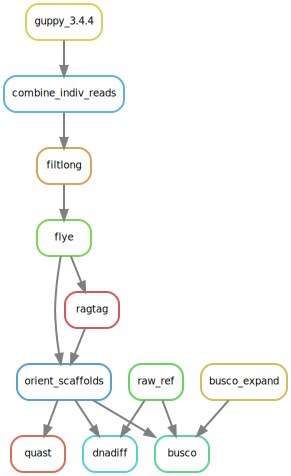

# basecall-assembly-compare

Use a bunch of old [guppy containers](http://datasets.datalad.org/?dir=/shub/TomHarrop/ont-containers) to re-basecall some reads and run assemblies.

Compare with busco, meryl and ref genome.

